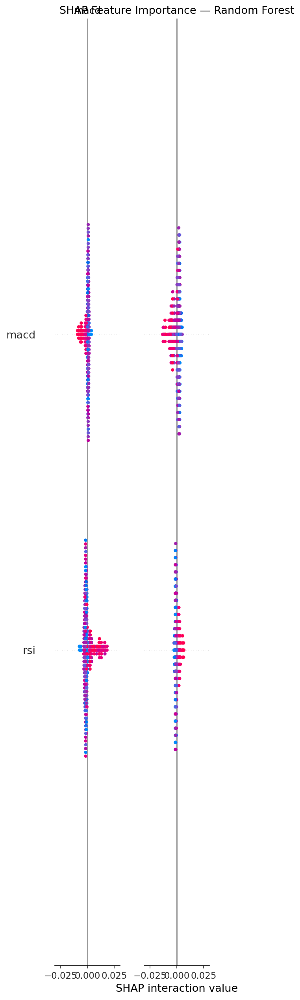

# 📈 Stock Movement Predictor

> A machine learning system that predicts whether an Indian stock will be **higher 5 days from now** using a stacking ensemble of Random Forest, XGBoost, and SVM — with technical indicators, candlestick patterns, and Nifty 50 market context.

🔗 **[Live Demo](https://stock-predictor-8mna9ntef7mmldtwacsuug.streamlit.app/)** &nbsp;|&nbsp; 📊 **[Notebooks](notebooks/)** &nbsp;|&nbsp; 🧠 **[Model Reports](reports/)**

---

## 🗂️ Project Structure

```
stock-predictor/
├── app.py                        # Streamlit web app
├── src/
│   ├── data_loader.py            # loads and splits data
│   ├── feature_engineering.py   # indicators + candlestick patterns
│   ├── train.py                  # model training + stacking
│   └── explainability.py         # SHAP analysis
├── models/
│   ├── stacking_ensemble.pkl     # final stacking classifier
│   ├── random_forest.pkl
│   ├── xgboost.pkl
│   ├── svm.pkl
│   ├── scaler.pkl
│   └── feature_cols.pkl
├── reports/
│   ├── confusion_matrix.png
│   ├── roc_curve.png
│   ├── shap_summary.png
│   └── model_metrics.csv
├── notebooks/
│   ├── data_collection.ipynb
│   ├── model_train.ipynb
│   └── new_data_collection.ipynb
└── requirements.txt
```

---

## 🧠 How It Works

### Data
- **5 NSE stocks:** Reliance, TCS, Infosys, HDFC Bank, SBI
- **Date range:** 2018–2024 (training) | 2024–2026 (testing)
- **Market context:** Nifty 50 index features merged with each stock

### Features (34 total)
| Category | Features |
|---|---|
| Momentum | RSI, MACD, MACD Signal, MACD Histogram |
| Trend | EMA 20, EMA 50, EMA Cross |
| Volatility | Bollinger Bands (upper, lower, width), ATR |
| Volume | Volume MA, Volume Ratio |
| Price | 1d/5d/10d returns, lag 1/2/3 |
| Candlestick | Doji, Hammer, Engulfing, Shooting Star, Morning Star, Evening Star, Marubozu, 3 White Soldiers |
| Market Context | Nifty return 1d/5d, Nifty RSI, relative strength vs Nifty |

### Target
Predicts **5-day forward direction** (UP=1 / DOWN=0) — chosen over 1-day because it has stronger feature correlation and is more actionable.

### Model Architecture
```
Features (34)
     ↓
┌────────────────────────────────┐
│  Layer 1 — Base Models         │
│  Random Forest │ XGBoost │ SVM │
└────────────────────────────────┘
     ↓  out-of-fold predicted probabilities
┌────────────────────────────────┐
│  Layer 2 — Meta Learner        │
│     Logistic Regression        │
└────────────────────────────────┘
     ↓
Final Prediction (UP / DOWN)
```

---

## 📊 Results

| Model | Accuracy | Precision | Recall | F1 | ROC-AUC |
|---|---|---|---|---|---|
| SVM | 0.5049 | 0.5297 | 0.5259 | 0.5278 | 0.5145 |
| **Stacking Ensemble** | **0.5097** | **0.5315** | **0.5763** | **0.5530** | **0.5143** |
| Random Forest | 0.5349 | 0.5344 | 0.9019 | 0.6711 | 0.5095 |
| XGBoost | 0.5262 | 0.5262 | 1.0000 | 0.6896 | 0.4911 |

> **Why ~51% AUC?** Stock markets are close to efficient — even hedge funds with proprietary data rarely exceed 55% on short-term predictions. During this project I discovered that technical indicators have less than 3.5% linear correlation with next-day returns on Indian markets. The stacking ensemble was chosen for its **balanced precision/recall** rather than raw accuracy.

---

## 🔍 SHAP Explainability

The app shows not just a prediction but **why** the model made it — which features drove the decision.



---

## 🖥️ Streamlit App Features

- Select any of 5 NSE stocks
- Fetches live data via yfinance
- Shows prediction (UP/DOWN) + confidence score
- Displays current price + today's change
- Price chart with EMA 20/50
- Key indicator values (RSI, MACD, BB Width, Relative Strength)
- SHAP feature importance for the specific prediction

---

## 🚀 Run Locally

```bash
# 1. clone the repo
git clone https://github.com/TanishVenpure/stock-predictor.git
cd stock-predictor

# 2. install dependencies
pip install -r requirements.txt

# Note: TA-Lib is required for training notebooks only
# For Windows: download .whl from https://github.com/cgohlke/talib-build/releases

# 3. run the app (models are pre-trained and included)
streamlit run app.py
```

---

## 🛠️ Tech Stack

| Tool | Use |
|---|---|
| `scikit-learn` | Stacking classifier, RF, preprocessing |
| `XGBoost` | Gradient boosting base model |
| `SHAP` | Model explainability |
| `pandas-ta` / `ta` | Technical indicators |
| `TA-Lib` | Candlestick pattern detection (training only) |
| `yfinance` | Live and historical stock data |
| `Optuna` | Bayesian hyperparameter tuning |
| `Streamlit` | Web app deployment |
| `matplotlib` | Visualizations |

---

## 📁 Key Findings

- **1-day prediction is nearly random** — feature-target correlation < 0.035 for all indicators
- **5-day prediction** has stronger signal — correlation up to 0.059 (ATR)
- **Nifty 50 context** (relative strength vs index) is among the most predictive features
- **Overfitting was the main challenge** — XGBoost achieved 0.9998 train AUC vs 0.49 test AUC before regularization
- **Stacking outperforms individual models** on precision-recall balance

---

## 👤 Author

**Tanish Venpure**  
[GitHub](https://github.com/TanishVenpure) | [LinkedIn](https://www.linkedin.com/in/tanish-venpure-401876332/)

---

> ⚠️ **Disclaimer:** This project is for educational purposes only. It is not financial advice. Do not use model predictions for actual trading decisions.